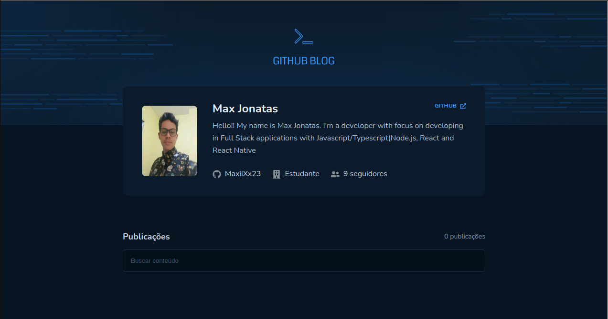
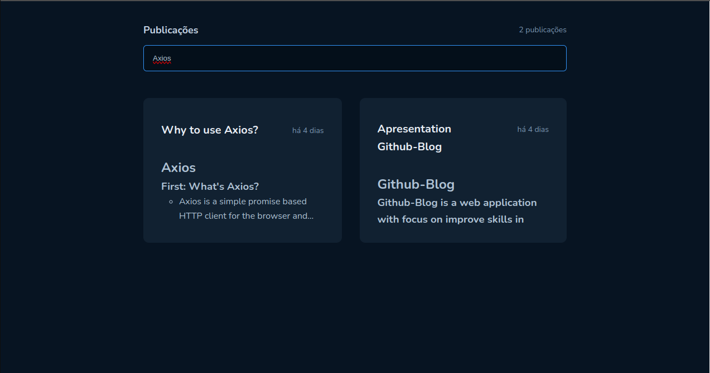
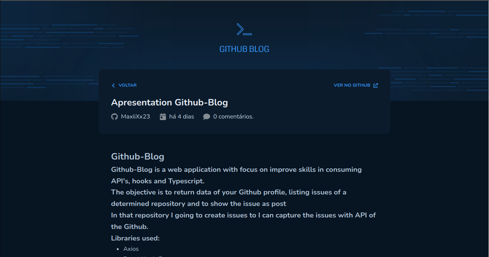

### Desafio 03 - Módulo 03 - Trilha ReactJS Ignite 2022/2023
### ***Github-Blog***
#### Sobre o projeto:
 * Github-Blog é um desafio que tem como objetivo criar um blog utilizando a API REST do Github para buscar dados do perfil do usuário, assim como as issues de determinado repositório.

### Principais tecnologias usadas no desenvolvimento:

* TypeScript
* ReactJS(Vite)
* react-hook-form
* Axios

### Biblioteca em destaque:

* Axios

### API usada:
#### Front-end:
* API REST Github

### Passo-a-passo para rodar a aplicação:
1. Entre na pasta Github-Blog;
2. use o comando: ***yarn*** ou ***npm install/i*** para instalar os pacotes;
3. use o comando: ***yarn dev*** ou ***npm run dev*** para rodar a aplicação.